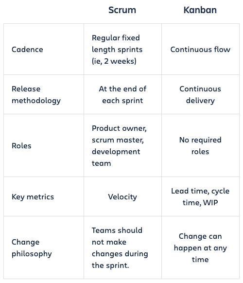

# Introduction to agile

## What is agile and why do we use ?

Let us image a scenario where you have to deliver a swing where kids\adults can play during their free hours

> **_Agile is a structured and iterative approach to project management and product development. It recognizes the volatility of product development, and provides a methodology for self-organizing teams to respond to change without going off the rails. Today, agile is hardly a competitive advantage. No one has the luxury to develop a product for years or even months in a black box. This means it’s more important than ever to get it right._**

- Agile is a methodology which **helps in slicing** the 6 months of work into smaller chunks of feature that you can demo\use is production. 

- It also helps in **determining the minimum product or list of features** the user can start off with. Which helps in faster return of investment.

- It is always better to **fail fast and retrospect**. Imagine you get your feedback of your product from the business owner after 6 months when you start getting feedbacks from stakeholders within 2 weeks.

## Manifesto of agile software development

## Principles of agile

## What is scrum or kanban ?

Scrum and kanban are frameworks that help teams adhere to agile principles and get stuff done.

Scrum teams commit to ship working software through set intervals called sprints. Their goal is to create learning loops to quickly gather and integrate customer feedback. 

Kanban is all about visualizing your work, limiting work in progress, and maximizing efficiency(or flow). Kanban teams focus on reducing the time it takes to take a project(or user story) from start to finish. 

## Story mapping process

> **_Be inclusive and get all the ideas in one place_**

### What ?

1.  Frame the journey(from business perspective) a.k.a product vision board
    https://www.gapsquad.com/scrum

2.  Create the backbone

3.  Build the body or elaborate

4.  Slice out the MVP (minimum viable product)

### How ?

Generally a meeting is conducted which is facilitated by the scrum master. 

### Who ?

The following members participate in this discussion:

- Product owner
- Scrum master
- Scrum team
- Architect

## Product backlog

> **_Heart of the product. These are the features of the product and also can include defects, investigative work(SPIKE) and could also be technical_**

The primary owner of this product backlog is the **Product owner**. Though the decision maker is the product owner, the product owner should in a collaborative fashion hear out everyone.

[Read more](https://www.agilealliance.org/glossary/backlog/)

### Characteristics of good product backlog

D - Detailed appropriately
E - Emergent
E - Estimated
P - Prioritized

### Grooming the backlog

1. Adding, refining and deleting
2. Estimates
3. Prioritize

## Sprint backlog

> **_The Product Backlog items selected for the sprint, along with the plan for delivering this is called the Sprint Backlog._**

The primary owner of this product backlog is the **Scrum team**.

## What is a Scrum Development Team?

As described in the Scrum Guide, a Scrum Development Team consists of professionals who do the work of delivering a potentially releasable Increment of “Done” product at the end of each Sprint. A "Done" increment is required at the Sprint Review. Only members of the Development Team create the Increment.

Development Teams are structured and empowered by the organization to organize and manage their own work. Development Teams have the following characteristics:

- They are self-organizing. No one (not even the Scrum Master) tells the Development Team how to turn Product Backlog into Increments of potentially releasable functionality;
- Development Teams are cross-functional, with all the skills as a team necessary to create a product Increment;
- Scrum recognizes no titles for Development Team members, regardless of the work being performed by the person; 
- Scrum recognizes no sub-teams in the Development Team, regardless of domains that need to be addressed like testing, architecture, operations or business analysis; and,
- Individual Development Team members may have specialized skills and areas of focus, but accountability belongs to the Development Team as a whole.

### Scrum development team size

Optimal Development Team size is small enough to remain nimble and large enough to complete significant work within a Sprint. Fewer than three Development Team members decrease interaction and results in smaller productivity gains.

## Scrum rituals

Each ritual is a face-to-face gathering in real time, which takes people away from the work they’re doing, and offers them the opportunity to have targeted communication with each other about the context of that work. Scrum favors communication over documentation, which is why it provides regular and clearly defined opportunities for various types of useful face-to-face communication.

### Not Another Meeting

#### Timebox

One of the most important concepts in scrum rituals is that of the time box. It’s the responsibility of the scrum master who hosts the rituals to keep everybody aware of exactly how long they have committed for this ritual, and how far along they are at any point within it.

Often scrum masters will write the time up on the whiteboard in front of the room, or keep a large clock visible so everybody can keep track of the time. The concept of time boxing empowers all the active participants in a ritual to encourage each other to get to the point when necessary, and remain focused on the objectives of the ritual.

### Backlog refinement (Sprint grooming)

keeping the backlog up to date and getting backlog items ready for upcoming sprints. This involves rewriting backlog items to be more expressive, deleting obsolete ones, splitting big items into smaller ones, resorting them, etc. That kind of things. Continuous backlog refinement is an enabler for incremental product delivery while staying flexible.

- Duration:
- Owner:
- Participants:

### Sprint planning

The purpose of sprint planning is to agree on a goal for the next sprint and the set of backlog items (aka sprint backlog) to achieve it. This involves more than just communicating requirements. It’s about learning, considering options and making decisions together.

Sprint planning consists of two main components: 
1. Prioritizing backlog items  
2. Agreeing on the number of backlog items in the sprint based on team capacity

- Duration:
- Owner:
- Participants:

### Daily standup

### Sprint retrospection

Sprint Retrospective is an opportunity for the Scrum Team to inspect itself and create a plan for improvements to be enacted during the next Sprint. The Sprint Retrospective occurs

- Duration:
- Owner:
- Participants:
